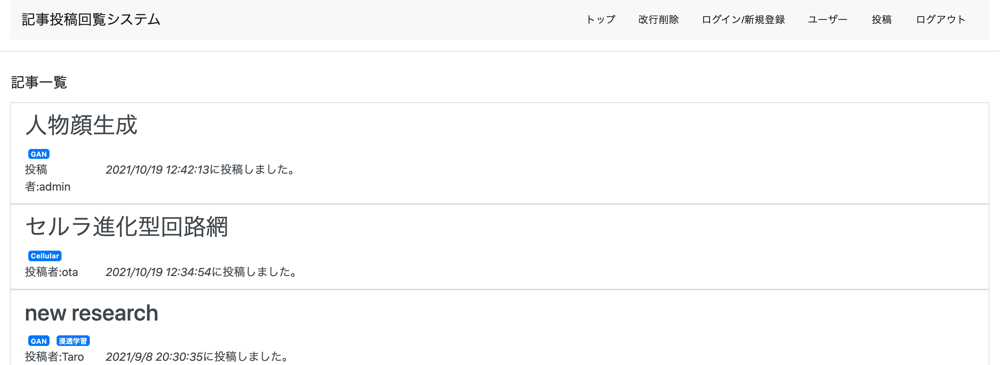

# 論文シェア掲示板


論文を読むのを助けてくれるwebアプリ  
ユーザ同士で読んだ論文をまとめてshare  
論文を翻訳にかけるときにpdfの邪魔な改行を削除してくれる便利機能付き

# How to Start
```bash
git clone git@github.com:KOKI9861/paper-share.git
docker-compose up -d
```
上記コマンドで  
フロントエンドがhttp://localhost:3000 
バックエンドがhttp://localhost:8000  
に起動する．

停止する際は
```bash
docker-compose down
```
<br></br>
ページが開けないときは
```bash
docker ps
```
でコンテナが動いていることを確認  
動いていたら以下でログの確認ができる
```bash
docker logs <コンテナ名>
```